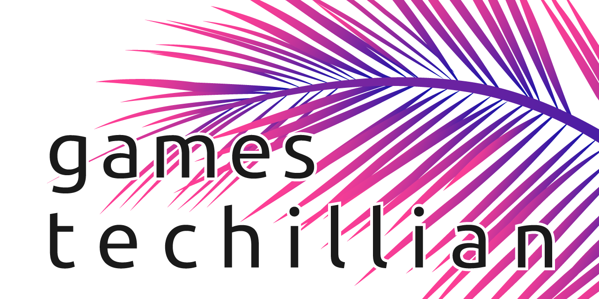

# Games for gather.town


No more searching for games, multiple Advanced Objects and multiple tabs (except for CORS).
Just embed this github page: `https://Techillian.github.io/gather-games`

Instant open specific games by adding to url: `?g=game-id`

You can use this  as game object

## Recommend new games

Pull requests and add your game as follows:

### Add to `/src/games.json`

Fill all fields (required)

```JSON
{
  "id": "unique-id-in-lowercase-without-special-chars",
  "name": "Game title",
  "desc": "Game description",
  "url": "Direct url to game",
  "players": {
    "min": 1,
    "max": 4
  },
  "fav": false
},
```

### Add to `/public/img/`

Add `g-your-game-id.png` to images in transparent PNG format. (Image optional)

## Setup app

<details>
  <summary>Click to expand</summary>
  
  ### Get started

  Install the dependencies...

  ```bash
  cd gather-games
  npm install
  ```

  ...then start [Rollup](https://rollupjs.org):

  ```bash
  npm run dev
   ```

  Navigate to [localhost:5000](http://localhost:5000). You should see your app running. Edit a component file in `src`, save it, and reload the page to see your changes.

  By default, the server will only respond to requests from localhost. To allow connections from other computers, edit the `sirv` commands in package.json to include the option `--host 0.0.0.0`.

  If you're using [Visual Studio Code](https://code.visualstudio.com/) we recommend installing the official extension [Svelte for VS Code](https://marketplace.visualstudio.com/items?itemName=svelte.svelte-vscode). If you are using other editors you may need to install a plugin in order to get syntax highlighting and intellisense.

  ### Building and running in production mode

  To create an optimized version of the app:

  ```bash
  npm run build
  ```

  You can run the newly built app with `npm run start`. This uses [sirv](https://github.com/lukeed/sirv), which is included in your package.json's `dependencies` so that the app will work when you deploy to platforms like [Heroku](https://heroku.com).

  ### Deploying to the web

  #### With [Vercel](https://vercel.com)

  Install `vercel` if you haven't already:

  ```bash
  npm install -g vercel
  ```

  Then, from within your project folder:

  ```bash
  cd public
  vercel deploy --name my-project
  ```

  #### With [surge](https://surge.sh/)

  Install `surge` if you haven't already:

  ```bash
  npm install -g surge
  ```

  Then, from within your project folder:

  ```bash
  npm run build
  surge public my-project.surge.sh
  ```

</details>

## ToDo

- [ ] Show loading state when iframe change
